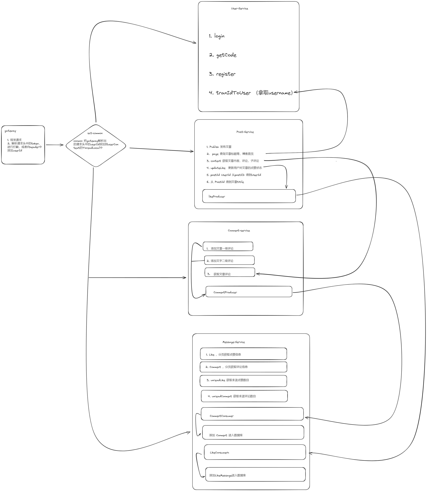
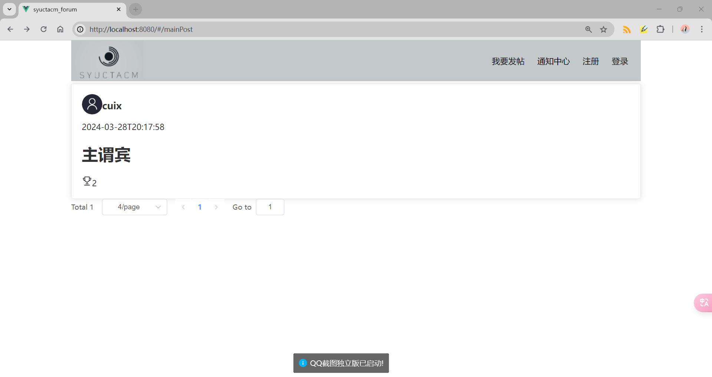
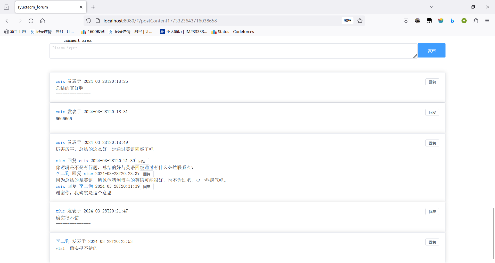
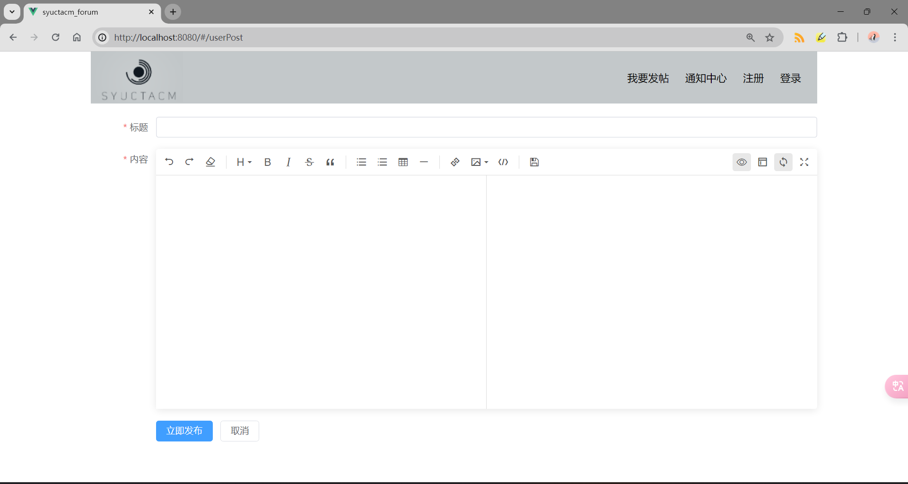
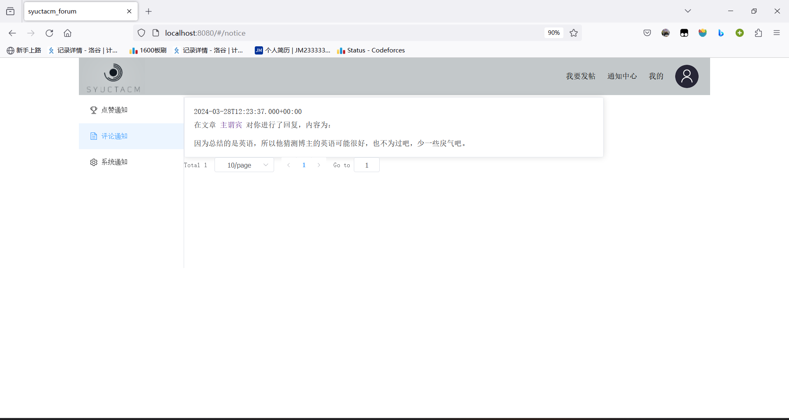
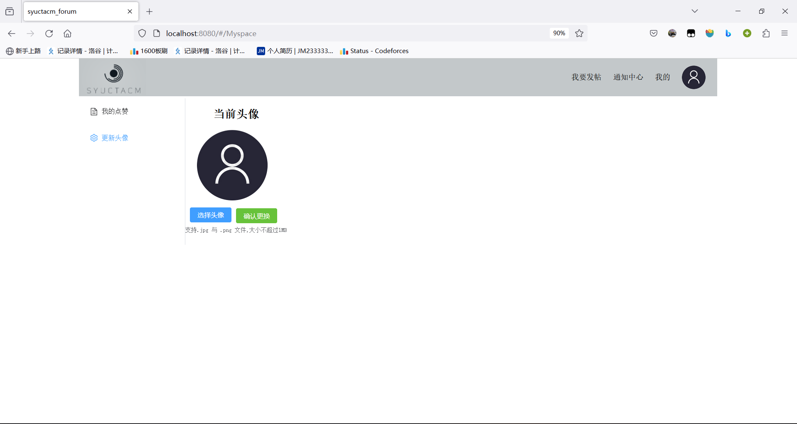

# 一个SpringBoot + Vue 的论坛项目

## 前端地址与后端技术栈
- [前端项目地址](https://github.com/x1uc/community-vue)
- 后端技术栈：SpringBoot + SpringCloud GateWay + Nacos + OpenFeign +  MySQL + Redis + Kafka + Mybatis Plus

## 模块和项目架构
### 项目主要模块
- 用户模块 -> User-Service
- 帖子模块和点赞模块 -> Post-Service
- 评论模块 -> Comment-Service
- 消息模块 -> Message-Service

### 项目基本架构

## 项目展示

